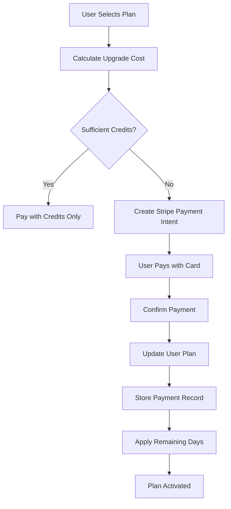

# 🎉 Enhanced Payment System - Complete Implementation

## ✅ What We've Built

### 🗃️ **1. Payment Model** (`/models/paymentModel.js`)

Complete payment tracking system with:

- **Payment History**: Track every transaction attempt
- **Amount Breakdown**: Credits used, Stripe charges, upgrade costs
- **Stripe Integration**: Payment intent tracking and status
- **Audit Trail**: Complete record of all payment events
- **Refund Support**: Built-in refund tracking capabilities

### 👤 **2. Enhanced User Model**

**Old Structure:**

```javascript
remainingDays: { type: Number, default: 0 } // Single value
```

**New Structure:**

```javascript
remainingDays: [
  {
    planId: ObjectId, // Which plan the days came from
    days: Number, // How many days remaining
    storedAt: Date, // When these days were stored
    planSnapshot: {
      // Plan details at time of storage
      name: String,
      price: Number,
      pricePeriod: String,
    },
  },
];
```

**Why This Matters:**

- **Dynamic Plans**: Handle unlimited plans created by admin
- **Multiple Upgrades**: User can upgrade through multiple plans (Free → Starter → Pro → Business → Enterprise)
- **Fair Value**: Always uses most expensive plan's remaining days first

### 💳 **3. Smart Payment Logic**

#### **Upgrade Scenario Example:**

```
User Journey: Starter ($10/month) → Pro ($25/month)
Current Plan: Starter with 15 days remaining
Calculation:
- Remaining Value: 15 days × ($10/30 days) = $5.00
- Upgrade Cost: $25.00 - $5.00 = $20.00
- User Credits: $18.00
- Stripe Charge: $20.00 - $18.00 = $2.00
```

#### **Multiple Upgrade Example:**

```
User Path: Free → Starter → Pro → Business
Remaining Days Stored:
[
  { planId: "starter_id", days: 10, planSnapshot: { price: 1000 } },
  { planId: "pro_id", days: 5, planSnapshot: { price: 2500 } }
]

When Plan Expires: Uses Pro's 5 days (more expensive) first
```

### 🔄 **4. Auto-Renewal with Intelligence**

When user's plan expires:

1. **Try Auto-Renewal** (if enabled):

   - Use credits to renew current plan
   - Apply stored remaining days to extend further

2. **Try Auto-Upgrade to Pro** (if insufficient credits):

   - Use credits to upgrade to Pro plan
   - Apply stored remaining days

3. **Revert to Starter** (last resort):
   - Apply most expensive plan's remaining days to extend Starter
   - User gets value from previous expensive plans

### 📊 **5. Complete Payment Flow**



## 🎯 Key Improvements Made

### **1. Scalability**

- ✅ Supports unlimited dynamic plans
- ✅ Handles complex upgrade paths
- ✅ Scales with business growth

### **2. Fairness**

- ✅ Users never lose value from unused plan time
- ✅ Always applies most valuable remaining days first
- ✅ Transparent cost calculations

### **3. Reliability**

- ✅ Complete audit trail of all payments
- ✅ Webhook backup for failed confirmations
- ✅ Comprehensive error handling

### **4. Business Intelligence**

- ✅ Track upgrade patterns
- ✅ Analyze payment methods
- ✅ Monitor plan popularity
- ✅ Revenue analytics ready

## 🚀 Example Usage Scenarios

### **Scenario 1: Simple Credit Purchase**

```javascript
// User has $30 credits, wants $25 Pro plan
POST /user/payment/purchase-with-credits
{
  "planId": "pro_plan_id",
  "autoRenewal": true
}

// Result: Plan activated immediately, $5 credits remaining
```

### **Scenario 2: Mid-Cycle Upgrade**

```javascript
// User on $10 Starter (15 days left) → $25 Pro
POST /user/payment/create-subscription
{
  "planId": "pro_plan_id"
}

// Response: Upgrade cost $20 (saved $5 from remaining days)
```

### **Scenario 3: Plan Expiry with Stored Days**

```javascript
// User's Pro plan expires, has 10 days from previous Business plan
// Auto-renewal disabled, insufficient credits
// Result: Reverted to Starter but extended by 10 days
```

## 📁 Files Created/Modified

### **New Files:**

- `/models/paymentModel.js` - Complete payment tracking
- `/PAYMENT_FLOW_COMPLETE.md` - Comprehensive documentation

### **Enhanced Files:**

- `/models/userModel.js` - Array-based remaining days
- `/controllers/paymentController.js` - Payment model integration
- `/utils/planUtils.js` - Smart remaining days logic
- `/config/stripe.js` - Stripe configuration
- `/routes/paymentRoutes.js` - Payment API endpoints
- `/controllers/webhookController.js` - Stripe webhooks

## 🎁 Bonus Features

### **1. Payment History API**

```javascript
GET / user / payment / history;
// Returns complete payment history with plan details
```

### **2. Admin Analytics**

```javascript
// Built-in methods for business intelligence
Payment.aggregate([
  {
    $group: { _id: "$planId", totalRevenue: { $sum: "$amounts.totalAmount" } },
  },
]);
```

### **3. Refund Support**

```javascript
// Built-in refund tracking (for future implementation)
payment.refund = {
  refundId: "re_stripe_refund_id",
  refundAmount: 1500,
  refundedAt: new Date(),
  reason: "Customer request",
};
```

## 🏁 What's Next?

The payment system is now **production-ready** with:

- ✅ Comprehensive payment tracking
- ✅ Smart upgrade calculations
- ✅ Dynamic plan support
- ✅ Fair remaining days logic
- ✅ Complete audit trail
- ✅ Stripe integration with webhooks
- ✅ Error handling and recovery

The system automatically handles:

- Any number of plans created by admin
- Complex upgrade paths
- Mid-cycle upgrades with fair pricing
- Auto-renewal with stored value preservation
- Plan expiry with intelligent fallback logic

**Ready for testing and deployment!** 🚀
